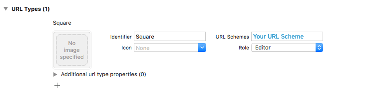
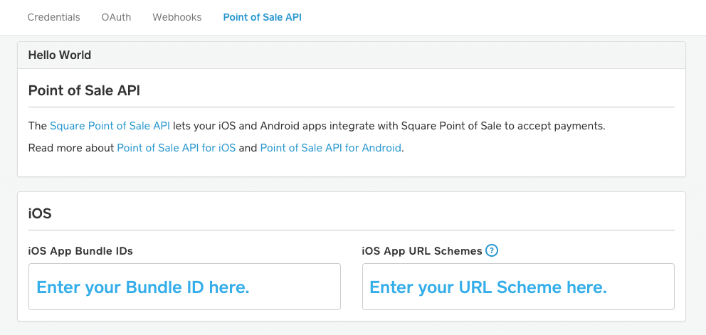
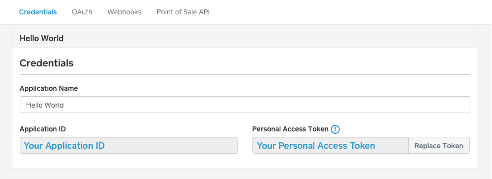

# Square Point of Sale SDK

[](https://travis-ci.org/square/SquarePointOfSaleSDK-iOS)
[](https://github.com/Carthage/Carthage/)
[](http://cocoadocs.org/docsets/SquarePointOfSaleSDK)
[](http://cocoadocs.org/docsets/SquarePointOfSaleSDK)
[](http://cocoadocs.org/docsets/SquarePointOfSaleSDK)

The Square Point of Sale SDK lets you quickly and easily add support to your application for completing in-store payments using Square Point of Sale.

## Requirements
* A [Square developer account](https://squareup.com/signup?v=developers).
* Xcode 8.0 or later.
* iOS 9 or later.

It is not currently possible to process a fake credit card payment with the Point of Sale API. If you are testing your integration, you can process small card payments (as low as $1) and then [issue refunds from Square Point of Sale](https://squareup.com/help/us/en/article/5060). Please visit [squareup.com/activate](https://www.squareup.com/activate) to ensure your account is enabled for payment processing.

## Getting started

### Add the SDK to your project

#### [CocoaPods](https://cocoapods.org)
```
platform :ios, '9.0'
pod 'SquarePointOfSaleSDK'
```

Be sure to call `pod update` and use `pod install --repo-update` to ensure you have the most recent version of the SDK installed.

#### [Carthage](https://github.com/Carthage/Carthage)
```
github "Square/SquarePointOfSaleSDK-iOS"
```

#### Git Submodules
Checkout the submodule with `git submodule add https://github.com/square/SquarePointOfSaleSDK-iOS.git`, drag SquarePointOfSaleSDK.xcodeproj to your project, and add SquarePointOfSaleSDK as a build dependency.

-------------------------------

### Update your Info.plist

To get started with the Square Point of Sale SDK, you'll need to configure your `Info.plist` file with a few changes.

First, navigate to your project's settings in Xcode and click the "Info" tab. Under `Custom iOS Target Properties`:
1. Add a new entry with key `LSApplicationQueriesSchemes`.
2. Set the "Type" to `Array`.
3. Add the value `square-commerce-v1` to the array.

Next, create a [URL scheme](https://developer.apple.com/library/content/documentation/iPhone/Conceptual/iPhoneOSProgrammingGuide/Inter-AppCommunication/Inter-AppCommunication.html#//apple_ref/doc/uid/TP40007072-CH6-SW1) so that Square Point of Sale can re-open your app after a customer finishes a transaction. If your app already has a URL scheme, you can use that.

Finally, open the "URL Types" section and click the "+" to add a new URL type.
Set the values to the following:

Property    | Value
----------- | -----------------
Identifier  | Square
URL Schemes | *Your URL Scheme*
Role        | Editor

-------------------------------

It should look like this:



### Register your app with Square

Go to the [Square Developer Portal](https://connect.squareup.com/apps) and create a new application.

Under the `Point of Sale API` tab, add your app's [bundle identifier](https://developer.apple.com/library/content/documentation/IDEs/Conceptual/AppDistributionGuide/ConfiguringYourApp/ConfiguringYourApp.html#//apple_ref/doc/uid/TP40012582-CH28-SW16) and [URL scheme](https://developer.apple.com/library/content/documentation/iPhone/Conceptual/iPhoneOSProgrammingGuide/Inter-AppCommunication/Inter-AppCommunication.html#//apple_ref/doc/uid/TP40007072-CH6-SW1), then click "Save".



Get your `Application ID` from the `Credentials` tab.



-------------------------------
## Usage

### Swift
**Import Declaration:** `import SquarePointOfSaleSDK`

```swift
// Replace with your app's URL scheme.
let yourCallbackURL = URL(string: "your-url-scheme://")!

// Your client ID is the same as your Square Application ID.
// Note: You only need to set your client ID once, before creating your first request.
SCCAPIRequest.setClientID("YOUR_CLIENT_ID")

do {
    // Specify the amount of money to charge.
    let money = try SCCMoney(amountCents: 100, currencyCode: "USD")

    // Create the request.
    let apiRequest =
        try SCCAPIRequest(
            callbackURL: yourCallbackURL,
            amount: money,
            userInfoString: nil,
            merchantID: nil,
            notes: "Coffee",
            customerID: nil,
            supportedTenderTypes: .all,
            clearsDefaultFees: false,
            returnAutomaticallyAfterPayment: false
        )

    // Open Point of Sale to complete the payment.
    try SCCAPIConnection.perform(apiRequest)

} catch let error as NSError {
    print(error.localizedDescription)
}
```

Finally, implement the UIApplication delegate method as follows:

```swift
func application(_ app: UIApplication, open url: URL, options: [UIApplicationOpenURLOptionsKey : Any] = [:]) -> Bool {
    guard let sourceApplication = options[.sourceApplication] as? String,
        sourceApplication.hasPrefix("com.squareup.square") else {
        return false
    }

    do {
        let response = try SCCAPIResponse(responseURL: url)

        if let error = response.error {
            // Handle a failed request.
            print(error.localizedDescription)
        } else {
            // Handle a successful request.
        }

    } catch let error as NSError {
        // Handle unexpected errors.
        print(error.localizedDescription)
    }

    return true
}
```

-------------------------------

### Objective C
**Import Declaration:** `@import SquarePointOfSaleSDK;`

```objc
// Replace with your app's callback URL.
NSURL *const callbackURL = [NSURL URLWithString:@"your-url-scheme://"];

// Specify the amount of money to charge.
SCCMoney *const amount = [SCCMoney moneyWithAmountCents:100 currencyCode:@"USD" error:NULL];

// Your client ID is the same as your Square Application ID.
// Note: You only need to set your client ID once, before creating your first request.
[SCCAPIRequest setClientID:@"YOUR_CLIENT_ID"];

SCCAPIRequest *request = [SCCAPIRequest requestWithCallbackURL:callbackURL
                                                        amount:amount
                                                userInfoString:nil
                                                    merchantID:nil
                                                         notes:@"Coffee"
                                                    customerID:nil
                                          supportedTenderTypes:SCCAPIRequestTenderTypeAll
                                             clearsDefaultFees:NO
                               returnAutomaticallyAfterPayment:NO
                                                         error:&error];
```

When you're ready to charge the customer, bring Point of Sale into the foreground to complete the payment:

```objc
[SCCAPIConnection performRequest:request error:&error];
```

Finally, implement the relevant UIApplication delegate.

```objc
- (BOOL)application:(UIApplication *)application openURL:(NSURL *)URL options:(NSDictionary<NSString *,id> *)options;
{
    NSString *const sourceApplication = options[UIApplicationOpenURLOptionsSourceApplicationKey];
    if ([sourceApplication hasPrefix:@"com.squareup.square"]) {
        SCCAPIResponse *const response = [SCCAPIResponse responseWithResponseURL:URL error:&decodeError];
        ...
        return YES;
    }
    return NO;
}
```

## Contributing
We’re glad you’re interested in Square Point of Sale SDK, and we’d love to see where you take it. Please read our [contributing guidelines](Contributing.md) prior to submitting a Pull Request.

## Support
If you are having trouble with using this SDK in your project, please create a question on [Stack Overflow](https://stackoverflow.com/questions/tagged/square-connect) with the `square-connect` tag. Our team monitors that tag and will be able to help you. If you think there is something wrong with the SDK itself, please create an issue.

## License
Copyright 2017 Square, Inc.

Licensed under the Apache License, Version 2.0 (the "License"); you may not use this file except in compliance with the License. You may obtain a copy of the License at

    http://www.apache.org/licenses/LICENSE-2.0

Unless required by applicable law or agreed to in writing, software distributed under the License is distributed on an "AS IS" BASIS, WITHOUT WARRANTIES OR CONDITIONS OF ANY KIND, either express or implied. See the License for the specific language governing permissions and limitations under the License.
